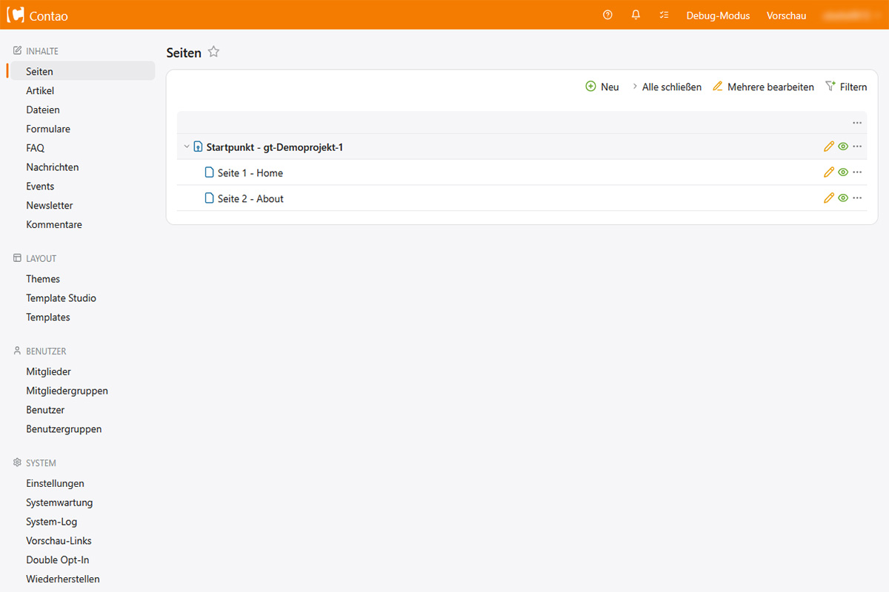
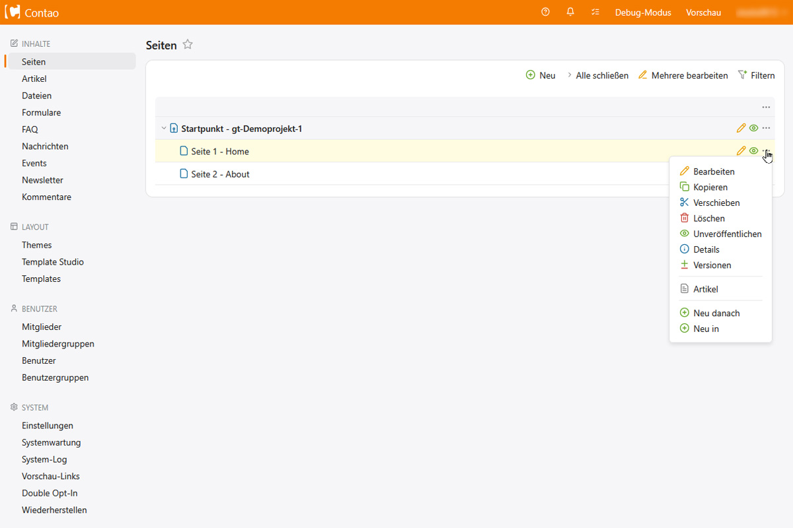
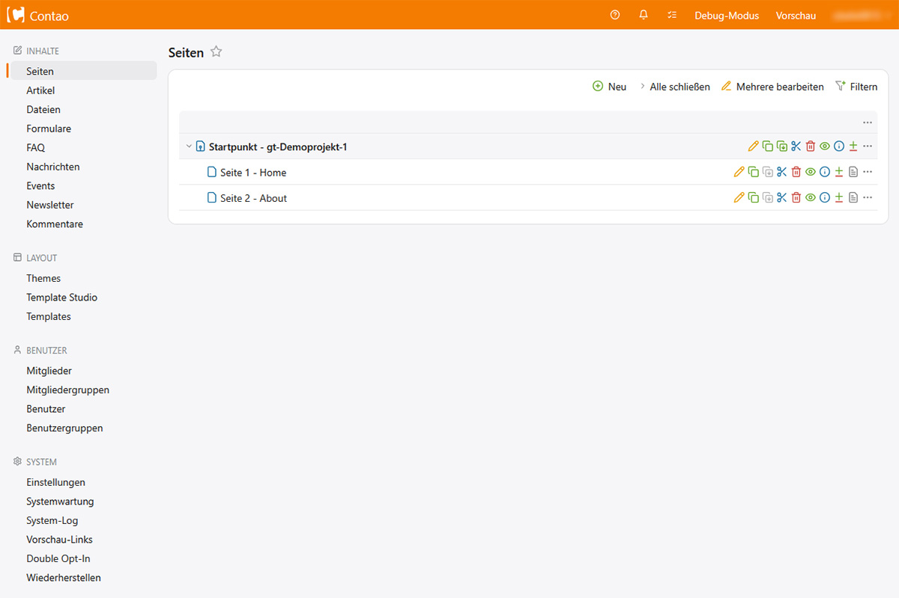
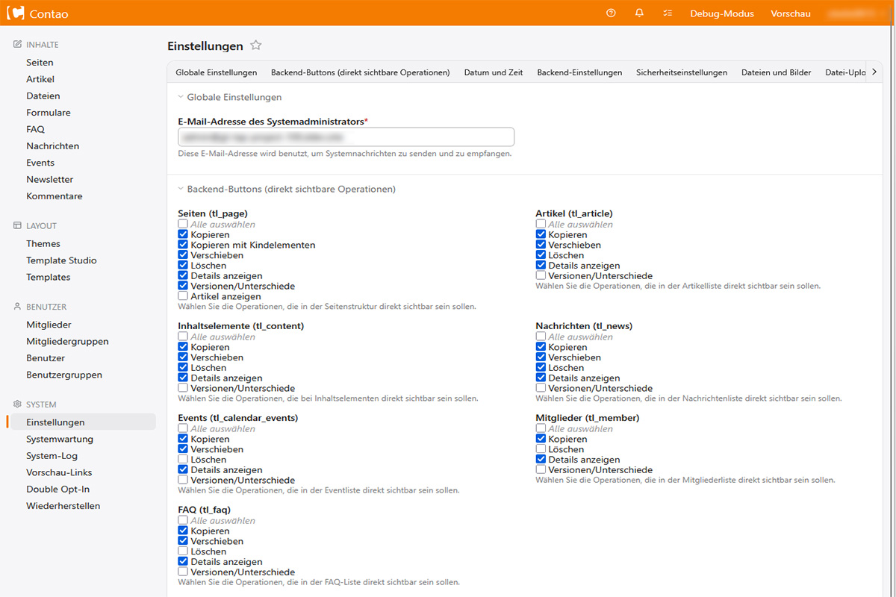

# contao-backend-buttons-bundle


**Contao 5.7 Erweiterung – Backend-Operationen** (wie Kopieren, Verschieben, Löschen etc.) wieder direkt sichtbar machen, ohne sie über das Dropdown-Menü aufrufen zu müssen.

> Entwickelt von **Grobitec IT-Service Jürgen Witlake** | Dev-Version 1.0.0 <br>
> Beratung und Fachexpertise durch **edm-service Marco Pracht** | [www.webdesign24.biz](https://www.webdesign24.biz/)
 

---

## Inhaltsverzeichnis

1. [Zweck](#zweck-dieser-erweiterung)
2. [Bilder](#Vorschaubilder)
3. [Voraussetzungen](#voraussetzungen)
4. [Installation](#installation)
5. [Konfiguration](#konfiguration)
6. [Deinstallation](#deinstallation)

 

---
## Zweck dieser Erweiterung
In **Contao 5.7** sind einige Backend-Operationen (wie Kopieren, Verschieben, Löschen oder Details anzeigen) nur noch in einem Dropdown&#8209;Menü zu finden. Das heißt es muss für viele Aktionen immer erst das Menü geöffnet werden. 
Obwohl ich von der neuen LTS Version sehr begeistert bin, finde ich aus persönlichen Gewohnheitsgründen das Dropdown-Menü zwar modern, aber manchmal _etwas_ unpraktisch.  
Daher habe ich mich entschlossen, eine Erweiterung zu schreiben, die diese Funktion wieder herstellt.

Mit diesem Bundle wird das Contao-Backend um Einstellungen erweitert, die es ermöglichen, **ausgewählte Operationen wieder direkt als Icon&#8209;Buttons** in der Listenansicht anzuzeigen – ähnlich wie es in Contao 5.3 der Fall war.

---
## Vorschaubilder

<!--  -->
#### Ohne Erweiterung

#### Mit Erweiterung 

#### Individuelle Einstellungsmöglichkeiten



---

## Voraussetzungen

- **Contao** ≥ 5.7
- **PHP** ≥ 8.3
- **Composer** (für die Installation)

---

## Installation 

### über Packagist (TODO - NOCH NICHT VERÖFFENTLICHT - FOLGT NOCH)

```bash
composer require grobitec/contao-backend-buttons-bundle
```

---

## Konfiguration

Nach der Installation befinden sich die Einstellungen unter:

**Backend → System → Einstellungen → Abschnitt „Backend-Buttons"**

Dort findet sich für jede unterstützte Tabelle eine Gruppe von Checkboxen:

| Tabelle | Einstellungsfeld | Verfügbare Operationen |
| --- | --- | --- |
| Seiten (`tl_page`) | Seiten | Kopieren, Kopieren mit Kindelementen, Verschieben, Löschen, Details, Versionen, Artikel |
| Artikel (`tl_article`) | Artikel | Kopieren, Verschieben, Löschen, Details, Versionen |
| Inhaltselemente (`tl_content`) | Inhaltselemente | Kopieren, Verschieben, Löschen, Details, Versionen |
| Nachrichten (`tl_news`) | Nachrichten | Kopieren, Verschieben, Löschen, Details, Versionen |
| Events (`tl_calendar_events`) | Events | Kopieren, Verschieben, Löschen, Details, Versionen |
| Mitglieder (`tl_member`) | Mitglieder | Kopieren, Löschen, Details, Versionen |
| FAQ (`tl_faq`) | FAQ | Kopieren, Verschieben, Löschen, Details, Versionen |

**Hnweis: Einfach die gewünschten Checkboxen ankreuzen und die Einstellungen speichern**

---

## Deinstallation 
### (TODO - Entfernen testen!)

```bash
composer remove grobitec/contao-backend-buttons-bundle
php vendor/bin/contao-console cache:clear
```

---

Viel Erfolg bei euren Contao-Projekten und viel Spaß mit diesem Bundle! :)
